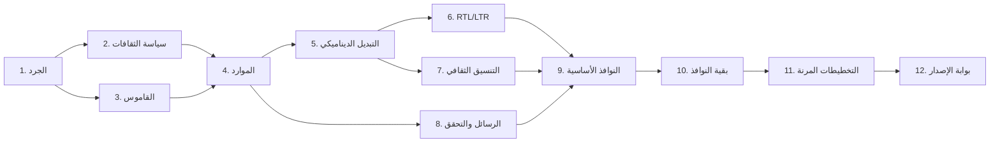

# خطة تنفيذ التوطين العربي/الإنجليزي

آخر تحديث: 2026-07-16  
النطاق: تطبيق AquaFarm Pro المكتبي (WinForms، .NET 8)  
الثقافات المعتمدة: `ar-SA` و`en-GB`

## الهدف ومعايير النجاح

الهدف هو الوصول إلى واجهة ثنائية اللغة قابلة للتبديل أثناء التشغيل، مع اتجاه صحيح، وعدم قص النصوص، وتنسيق ثقافي مركزي، وعدم ظهور نصوص خام أو رسائل استثناء للمستخدم. لا تعد أي مرحلة مكتملة قبل نجاح البناء والاختبارات الخاصة بها وتحديث سجل الجرد.

## خارطة المراحل حسب الأولوية

| # | الأولوية | المرحلة | المخرج القابل للتحقق | الحالة |
|---|---|---|---|---|
| 1 | P0 | جرد النصوص ومناطق التوطين | تقرير خط أساس + أداة جرد قابلة لإعادة التشغيل | مكتملة |
| 2 | P0 | تثبيت الثقافات وسياسة التنسيق | `SupportedCultures` وسياسة موثقة لـ ar-SA/en-GB | مكتملة |
| 3 | P0 | قاموس المصطلحات | قاموس عربي/إنجليزي مع مفاتيح ثابتة وملاحظات سياقية | مكتملة |
| 4 | P0 | تأسيس موارد الترجمة | ملفات RESX وخدمة وصول موحدة واختبارات موارد | مكتملة |
| 5 | P0 | محرك التغيير الديناميكي | تغيير اللغة والثقافة دون إعادة تشغيل وإشعار النوافذ المفتوحة | قيد التنفيذ |
| 6 | P0 | RTL/LTR ديناميكي | اتجاه ومحاذاة وترتيب عناصر متوافق مع اللغة | قيد التنفيذ |
| 7 | P1 | خدمة التنسيق الثقافي | توحيد التاريخ والأرقام والعملة مع استثناء بروتوكولات ZATCA | قيد التنفيذ |
| 8 | P1 | الأخطاء والتحقق والتنبيهات | رسائل مترجمة مبنية على رموز أخطاء؛ لا عرض مباشر لـ `ex.Message` | قيد التنفيذ |
| 9 | P1 | ترحيل النوافذ الأساسية | الدخول، الرئيسية، الإعدادات، القيود، والحوار المحاسبي | قيد التنفيذ |
| 10 | P1 | ترحيل بقية النوافذ والتقارير | تغطية جميع النوافذ والتقارير والطباعة | لم تبدأ |
| 11 | P2 | التخطيطات والخطوط المرنة | Auto-layout، دعم DPI، ومنع القص في اللغتين | لم تبدأ |
| 12 | P2 | بوابة الجودة والإصدار | اختبارات pseudo-localization وRTL وTab وDPI وتغطية الموارد | لم تبدأ |

## ترابط التنفيذ

## قواعد التنفيذ

- الموارد هي المصدر الوحيد لأي نص مرئي جديد؛ يمنع إدخال نص واجهة ثابت داخل C#.
- تستخدم مفاتيح دلالية مستقرة مثل `JournalEntries`، وليس النص نفسه كمفتاح.
- لغة الواجهة تحفظ كرمز ثقافة (`ar-SA`/`en-GB`) مع ترحيل القيم القديمة مثل «العربية» و«English» تلقائياً.
- بيانات الأعمال والتقارير القانونية تستخدم التقويم الميلادي افتراضياً. عرض التاريخ الهجري خيار منفصل مستقبلاً ولا يغير البيانات المخزنة.
- قيم بروتوكولات التكامل والتوقيع والـ XML، ومنها ZATCA، تبقى بالتنسيق invariant حيث يتطلب المعيار.
- إتمام كل نافذة يتطلب: موارد اللغتين، اتجاه صحيح، تنقل Tab، عدم قص عند 100% و150% و200% DPI، ورسائل تحقق مترجمة.

## بوابات القبول المرحلية

- **G0 بعد المرحلة 4:** تطابق مفاتيح ملفات الموارد 100%، واختبارات الثقافات والموارد ناجحة.
- **G1 بعد المرحلة 6:** التبديل ar-SA/en-GB يغير الثقافة والاتجاه للنوافذ المفتوحة دون إعادة تشغيل.
- **G2 بعد المرحلة 10:** لا توجد نصوص واجهة ثابتة جديدة، وتغطية جميع النوافذ المسجلة 100%.
- **G3 بعد المرحلة 12:** البناء والاختبارات ناجحة، ولا قص بصري أو خلط اتجاهات في مصفوفة DPI.

## سجل التقدم

- 2026-07-16: اعتماد الخطة وبدء التنفيذ.
- 2026-07-16: إكمال خط الأساس، سياسة الثقافات، وقاموس المصطلحات.
- 2026-07-16: بدء تأسيس ملفات الموارد وخدمة التوطين.
- 2026-07-16: إكمال موارد الأساس، وبدء محرك الثقافة والاتجاه الديناميكي.
- 2026-07-16: إضافة منسق مركزي للتاريخ والأرقام وSAR، وتوطين عناوين الرسائل المشتركة.
- 2026-07-16: إضافة ربط ديناميكي لعناصر WinForms وأعمدة الجداول والقوائم، وترحيل الإعدادات والقيود وحوار إضافة القيد.
- 2026-07-16: استبدال رسائل الاستثناء الخام في المسارات المرحّلة برسائل أعمال مترجمة مع إبقاء التفاصيل في السجل.
- 2026-07-16: ترحيل عنوان النافذة الرئيسية وأقسام قائمتها العليا وشريط الاختصارات إلى الموارد الديناميكية.
- 2026-07-16: إكمال الدفعة الثانية: شاشة الدخول، جميع القوائم الفرعية الرئيسية، نصوص مساحة المحاسبة، وقيم Enums المحاسبية.
